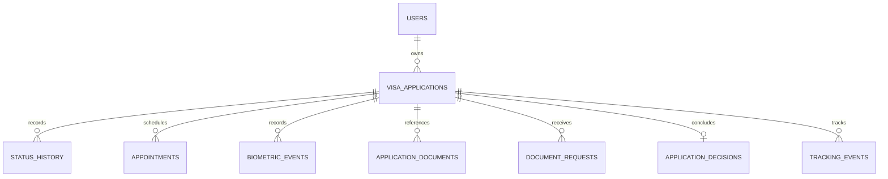

# Operational Data Model

## 1. Purpose

The operational model supports synthetic current and historical visa
applications. It is separate from the public knowledge corpus. All identifiers,
people, events, and document metadata are fictional.

## 2. Entity relationships

## 3. Core entities

| Entity | Required concepts |
|---|---|
| `users` | Synthetic user ID, display alias, demo persona, created time, active flag |
| `visa_applications` | Application ID, owning user ID, route, destination, submitted time, lifecycle state, current/historical label |
| `application_status_history` | Event ID, application ID, status code, display label, event time, recorded time, synthetic source |
| `appointments` | Appointment ID, application ID, type, scheduled time, location alias, status |
| `biometric_events` | Event ID, application ID, appointment ID if applicable, event type, occurred time |
| `application_documents` | Document record ID, application ID, safe document type, received time, review state; no real file or secret identifier |
| `additional_document_requests` | Request ID, application ID, requested categories, issued time, due time, response state, completed time |
| `application_decisions` | Decision record ID, application ID, recorded time, notification state, synthetic outcome where scenario requires it |
| `passport_courier_tracking` | Tracking event ID, application ID, delivery mode, synthetic carrier/reference alias, event type, event time |

Historical applications use the same schema and are distinguished by lifecycle
state and dates, not a separate unsecured archive.

## 4. Ownership and keys

- `users.user_id` is the root authorization key.
- Every application references exactly one user.
- Child records reference an application and inherit ownership through an
  authorization join to `visa_applications.user_id`.
- Public application references shown in the UI are not authorization secrets.
- Stable synthetic IDs support provenance and deterministic tests but must not
  encode real personal information.

## 5. Timeline semantics

Status history is append-oriented. `event_time` states when a synthetic event
occurred; `recorded_at` states when the portal recorded it. Current status is
derived using a documented ordering rule, while the stored application state is
checked for consistency. Corrections append a corrective event rather than
silently rewriting history.

Appointments, biometrics, requests, decisions, and tracking events have their
own timestamps and must not be inferred solely from a status label.

## 6. Provenance contract

Every application fact exposed to answer generation includes:

- entity/table type;
- stable synthetic record ID;
- application ID;
- event or observation timestamp;
- repository operation name;
- active user scope used for authorization.

The user scope is retained for validation but must not be echoed as sensitive
internal detail. Provenance proves where a fact came from; it does not grant
access.

## 7. Integrity rules

- Child records cannot reference a nonexistent application.
- Application ownership cannot change without an explicit controlled migration.
- Decision and closure events cannot precede submission.
- Biometrics cannot reference another application's appointment.
- Request completion cannot precede request issuance.
- Tracking events use chronological sequences appropriate to delivery mode.
- Current/historical labels agree with terminal status and dates.

## 8. Knowledge separation

No operational entity, row, free-text note, document metadata, or application
timeline is embedded in the shared knowledge index. Cross-domain answers join
evidence in memory only after authorization and retrieval.
