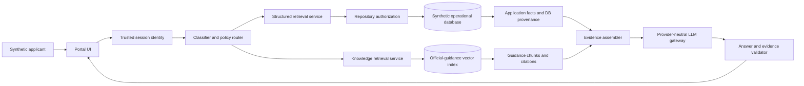
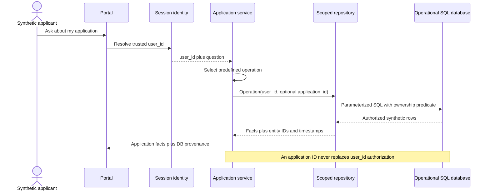
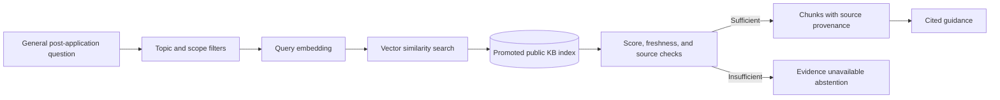
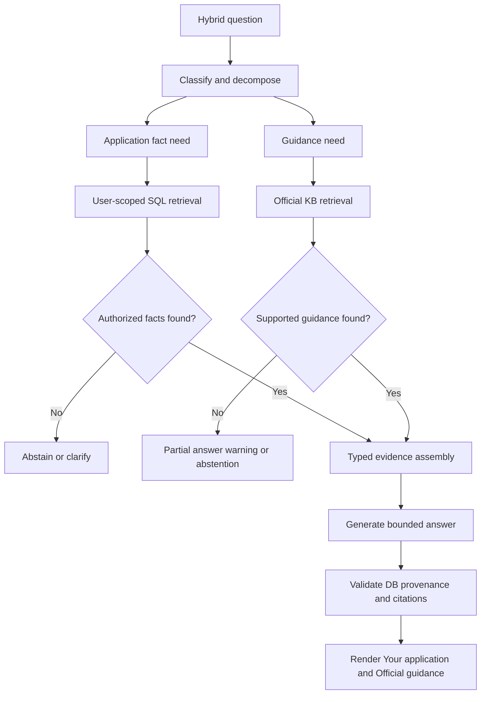
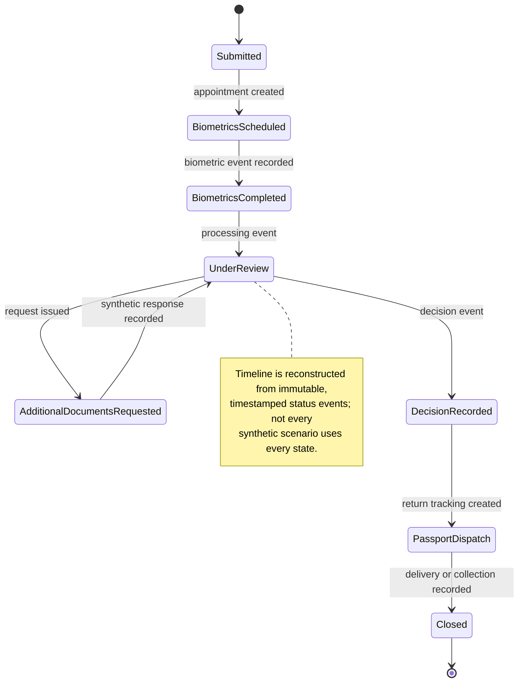
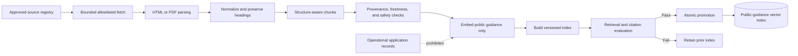
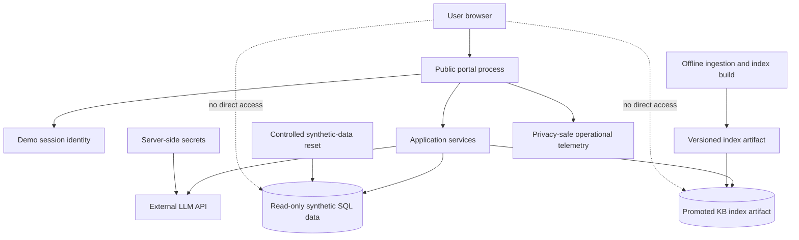

# Architecture Whiteboard

These diagrams describe the approved post-application design. SQL evidence and
knowledge evidence remain separate until answer assembly.

## Overall architecture

## Structured-data retrieval

## Knowledge retrieval

## Hybrid question flow

## Application status timeline

## Ingestion and indexing

## Public deployment

