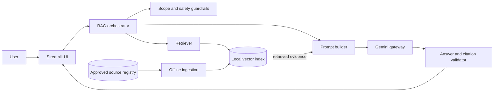
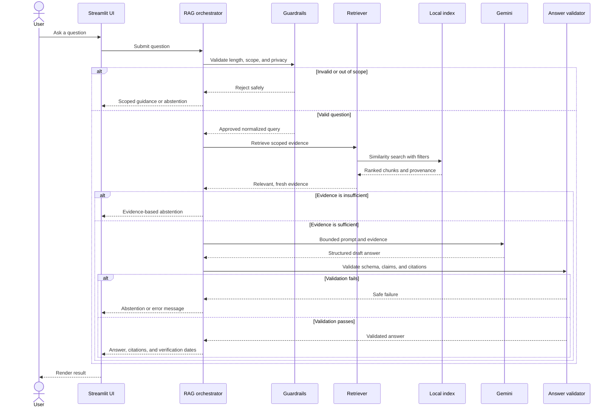
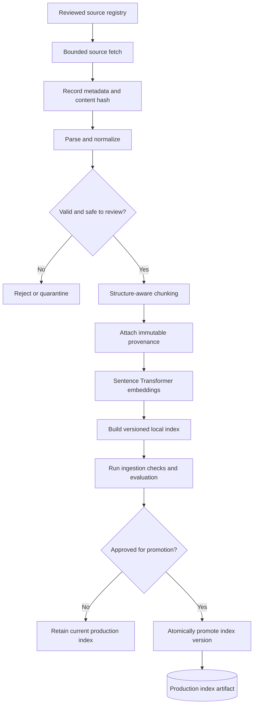
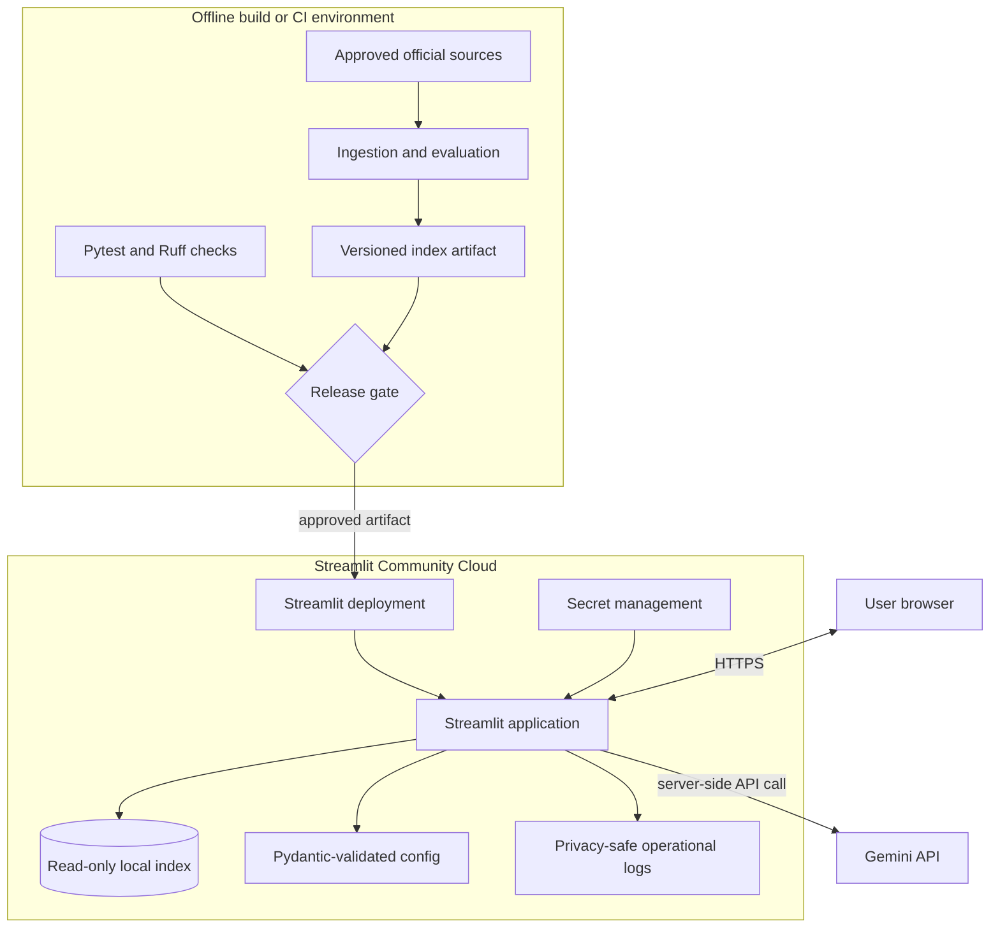

# Architecture Whiteboard

These diagrams capture the intended system shape. They are design aids rather
than deployed-state documentation and should evolve with implementation.

## Overall architecture

The public request path is separate from ingestion. The UI delegates policy,
retrieval, generation, and validation to application services.

## RAG query flow

## Ingestion pipeline

Fetching a document does not make it available to users. Validation, evaluation,
and explicit promotion form the publication gate.

## Deployment architecture

The deployed application loads a prebuilt index and never performs ingestion in
response to a user request. Provider credentials remain server-side.

